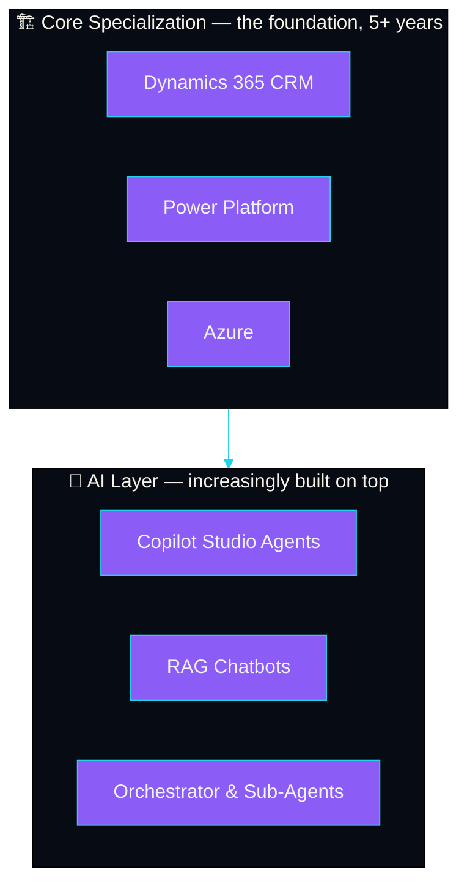
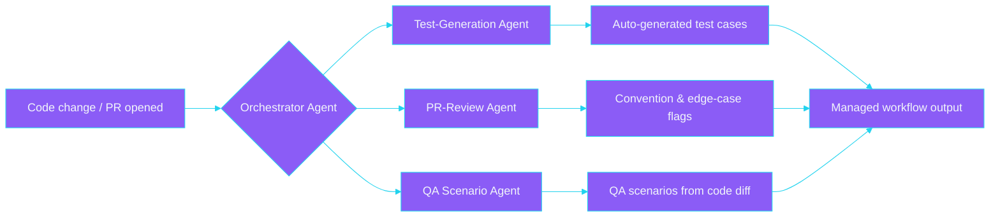

<!--
  GitHub Profile README for Ayush Soni.
  ZERO GitHub Actions / scheduled workflows — every visual below is either a
  stateless hosted image URL (capsule-render, readme-typing-svg, shields.io)
  or plain Markdown/HTML. Nothing here ever needs a commit to stay current.

  Brand tokens pulled from index.html:92-93 — violet #8B5CF6, cyan #22D3EE,
  bg #070B14 — so this matches the portfolio exactly, not a generic theme.

  v3 fix: the header banner previously used capsule-render's `type=waving`,
  which draws its gradient via an SVG <animate> that starts from an EMPTY
  path ("d=\"\"") and only fills in once the animation begins. Any renderer
  that grabs a frame before that first tick (a slow load, GitHub's image
  cache, a link-preview bot) shows a blank/broken sliver instead of the
  gradient — confirmed by fetching the raw SVG and rendering it standalone.
  Switched to `type=rect`, which bakes the full gradient into a static
  <path> with no animation dependency — verified full-bleed on both light
  and dark backgrounds. Never use an animated-fill capsule-render type for
  a profile banner; static types only.

  Placeholders to fill in before publishing (search for ⟦):
    ⟦GITHUB_USERNAME⟧  — must exactly match this repo's name to render on your profile
    ⟦LINKEDIN_HANDLE⟧  — your LinkedIn public profile slug
    ⟦EMAIL⟧            — an email you're comfortable publishing
    ⟦RESUME_URL⟧       — direct link to a hosted PDF (Drive/Dropbox share link, or
                          host it on the portfolio and link there)
    ⟦CERT_VERIFY_URL_*⟧ — Microsoft Learn / Credly verification link per cert
                          (leave the badge but drop the href if you'd rather
                          not publish direct verify links — your call)

  Manually bump the "Last updated" line near the bottom every few months —
  there's no Action doing it for you, and a stale-looking date undercuts an
  otherwise-current page more than no date at all.
-->

<div align="center">


<a href="https://ayushsoni25.com">
  
</a>


<p>
  <a href="⟦RESUME_URL⟧"></a>
  <a href="https://ayushsoni25.com"></a>
  <a href="https://linkedin.com/in/⟦LINKEDIN_HANDLE⟧"></a>
  <a href="mailto:⟦EMAIL⟧"></a>
</p>

</div>

<br />

```
$ whoami
ayush-soni · senior associate @ pwc

$ cat about.json
{
  "role": "Senior Associate, Dynamics 365 CRM & AI Solutions",
  "company": "PwC",
  "location": "⟦CITY, COUNTRY⟧",
  "open_to_relocation": ⟦true/false⟧,
  "experience": "5+ years",
  "certifications": 8,
  "focus": ["D365 CRM", "Power Platform", "Azure", "AI Agent Engineering"],
  "currently_exploring": ["Cloud Solution Architect", "AI Engineering roles"]
}
```

I architect enterprise **Dynamics 365 CRM & Power Platform** systems, and increasingly build the **AI layer on top of them** — Copilot Studio agents, RAG-grounded chatbots, and orchestrator agents that coordinate specialised sub-agents for review, testing, and QA. I bring the same AI-first approach into my own workflow too: Cursor- and Claude-driven test generation, PR-review agents, and `skill.md` files that teach coding agents my team's conventions.

**Note on this profile:** most of my production work lives in private enterprise/client repositories, not here — this page is a summary, not my activity feed. For real case studies and the full story, see **[ayushsoni25.com](https://ayushsoni25.com)**.

<br />

<div align="center"><sub>Where the AI work actually sits — not a replacement for the D365/Power Platform/Azure foundation, an extra layer on top of it.</sub></div>



<br />

<details open>
<summary><b>⚡ AI Engineering Highlights</b> — <i>click to expand</i></summary>
<br />

```diff
+ Built and deployed AI agents on Adobe's internal Cognito platform,
+ grounding conversational responses in live application data.

+ Designed a RAG-powered chatbot grounded in personalised, user-specific
+ data — keeping responses accurate to each user's own context.

+ Built an orchestrator agent coordinating specialised sub-agents
+ (review, test generation, QA) into one managed workflow.

+ Built an automated PR-review agent that flags convention drift
+ before a human reviewer looks.

+ Introduced a Cursor- and Claude-powered testing workflow that
+ auto-generates test cases straight from code changes.

+ Redesigned enterprise approval frameworks, reducing processing
+ time by ~35%.
```

**→ [Full case studies & impact log on the portfolio](https://ayushsoni25.com/#impact)**

</details>

<br />

### 🧩 How the orchestrator agent works

<sub>One diagram beats a paragraph of claims — this is the actual shape of the multi-agent workflow referenced above.</sub>



<br />

<details>
<summary><b>🏗️ Core Specialization — D365, Power Platform & Azure</b> — <i>click to expand</i></summary>
<br />

```diff
+ Built real-time SAP ↔ D365 CRM synchronization ensuring data
+ consistency across systems.

+ Converted complex Power Automate flows into optimized C# plugins
+ for better performance and maintainability.

+ Developed a Flow Monitoring System for error tracking — received
+ client recognition.

+ Created a WhatsApp-integrated CRM enabling 2-way customer
+ communication.

+ Delivered a Canvas App spanning 30+ screens with complex,
+ maintainable architecture.

+ Implemented Azure DevOps pipelines, GitHub Actions and Jenkins
+ CI/CD for continuous integration and deployment.
```

**→ [Full case studies & impact log on the portfolio](https://ayushsoni25.com/#impact)**

</details>

<br />

### 🎯 Signature build — client project-closure automation

| | |
|---|---|
| **Problem** | Manual, multi-entity project closure with no way to validate readiness before committing — slow, error-prone, hard to audit. |
| **Approach** | Automated live data validation, built a pass/fail readiness dashboard, and orchestrated multi-entity closure end-to-end. |
| **Stack** | Power Platform · Dynamics 365 · Cursor AI · Claude · Copilot |
| **Outcome** | Turned a manual, multi-step closure process into a validated, repeatable one — accelerating delivery for the client. |

<br />

### 🛠️ Stack

<p>
  
  
  
  
  
  
  <br />
  
  
  
  
  
</p>

<br />

### 🎓 Certifications — 8x Microsoft Certified

<p>
  <a href="⟦CERT_VERIFY_URL_PL900⟧"></a>
  <a href="⟦CERT_VERIFY_URL_MB910⟧"></a>
  <a href="⟦CERT_VERIFY_URL_PL400⟧"></a>
  <a href="⟦CERT_VERIFY_URL_AZ900⟧"></a>
  <br />
  <a href="⟦CERT_VERIFY_URL_PL200⟧"></a>
  <a href="⟦CERT_VERIFY_URL_MB230⟧"></a>
  <a href="⟦CERT_VERIFY_URL_AZ204⟧"></a>
  <a href="⟦CERT_VERIFY_URL_AB900⟧"></a>
</p>

<br />

<div align="center">
<i>Open to Dynamics 365, Power Platform & AI Engineering collaborations.</i>
<br />
<a href="https://ayushsoni25.com">ayushsoni25.com</a> · <a href="mailto:⟦EMAIL⟧">⟦EMAIL⟧</a>
<br /><br />
<sub>Last updated: August 2026</sub>
</div>
